# Spring WebFlux (3):  mysql+Springboot Security实现登录鉴权

Security主要有两个功能：

+ 登录
+ 鉴权

Security通过一个user相关类存储用户信息，实现UserDetails接口功能：

看一下Security自带的User类， 主要变量：

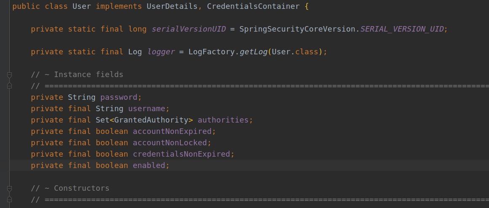

+ password：密码
+ username: 账户名
+ authorities： 访问权限
+ accountNonExpired：账户没有过期
+ isAccountNonLocked：账户没被锁定 （是否冻结）
+ isCredentialsNonExpired：密码没有过期
+ isEnabled：账户是否可用（是否被删除）

其中password用于登录，authorities用于鉴权。

## 登录

简单说一下登录流程

1. 一旦添加了Springboot Security依赖，访问api或者网页都会要求进行登录
2. 输入账号和密码之后，会将信息放入Authentication类的对象中
3. 得到的`Authentication`通过`AbstractUserDetailsReactiveAuthenticationManager`进行判断是否符合条件
4. 通过`authentication`中的username（就是登录名），触发retrieveUser(username)方法
5. retrieveUser方法 通过`ReactiveUserDetailsService`获取对应名字对象

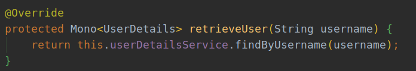

6. `ReactiveUserDetailsService`通过findByUsername方法从数据库或者内存中获取对应username的UserDetails对象，我们一般就是要自己编写这个方法获取user对象

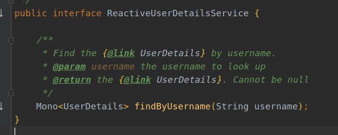

7. 得到的User后通过`AbstractUserDetailsReactiveAuthenticationManager`的authenticate方法进行判断是个否满足登录条件

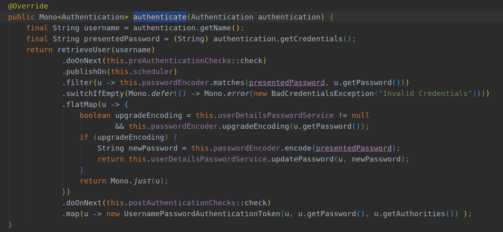

PS：

+ 默认的加密方法为

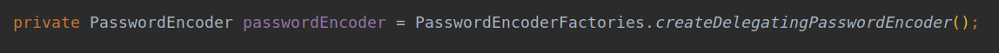

可以通过setPasswordEncoder() 更改加密方法

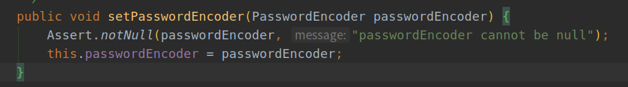

## 鉴权

鉴权需求可以有两种设置：

+ 配置SecurityConfig时写入FilterChain：

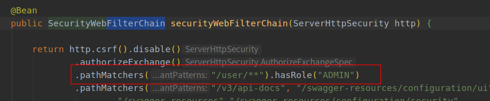

+ 编写controller时进行设置


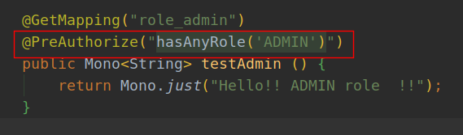

简单说下流程：

1. 鉴权主要在`SecurityExpressionRoot`类中完成
2. 有鉴权需求会通过`getAuthoritySet()`方法获取authentication中的权限信息，就是User类中的authorities变量转为set，这时我们有了该用户的所有权限类型

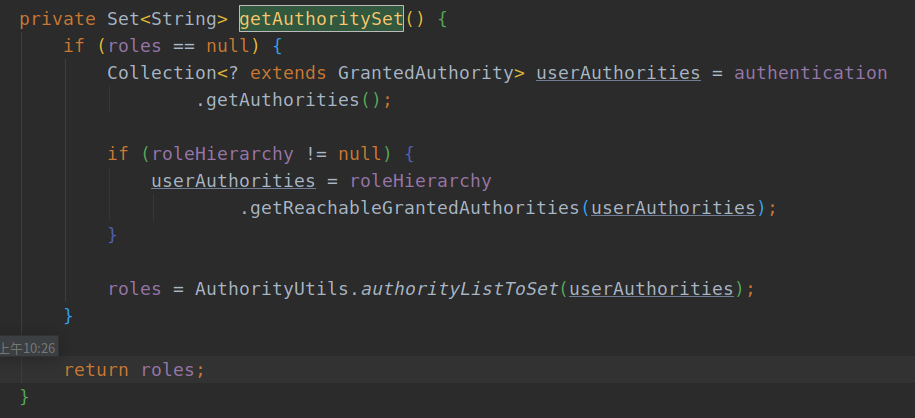

3. 无论使用的是`hasAuthority`， `hasAnyAuthority`， `hasRole` 还是 `hasAnyRole`，最终都是通过`hasAnyAuthorityName`方法进行判断

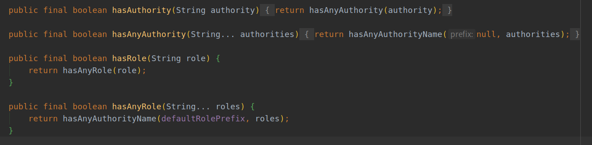

4.  `hasAnyAuthorityName`通过判断传入的role是否在用户roleSet中进而判断是否有使用权限

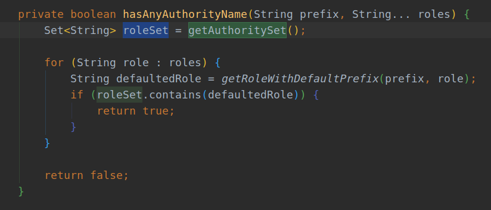

5.  一般`defaultRolePrefix`使用默认值

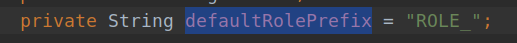

6. 当然也可以自己设置

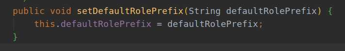

## 示例：

### 创建表：

```sql
DROP TABLE IF EXISTS `my_user`;
CREATE TABLE `my_user` (
                          `id` bigint(20) NOT NULL AUTO_INCREMENT,
                          `password` varchar(100) DEFAULT NULL,
                          `username` varchar(100) NOT NULL,
                          `authorities` varchar(255) DEFAULT NULL,
                          PRIMARY KEY (`id`),
                          UNIQUE KEY `name` (`username`)
) ENGINE=InnoDB DEFAULT CHARSET=utf8;
```


主要步骤有三点：

+ 编写securityConfig文件进行配置
+ 使用数据库获取用户数据需要编写对应的`UserDetailsService`
+ 编写自己的UserDetails类进行权限内容的获取及处理

### SecurityConfig.java

+ 鉴权我们最主要要做的就是想架构提供UserDetails以及获取的ReactiveUserDetailsService
+ 还有一种用于测试的通过内存编写用户信息的方法
+ 不过正常生产都是通过数据库

```java
/**
 * @author: ffzs
 * @Date: 2020/8/11 下午4:22
 */

@EnableWebFluxSecurity
@EnableReactiveMethodSecurity
public class SecurityConfig {

    @Bean
    public SecurityWebFilterChain securityWebFilterChain(ServerHttpSecurity http) {

        return http.csrf().disable()
                .authorizeExchange()
                .pathMatchers("/v3/api-docs", "/swagger-resources/configuration/ui",
                        "/swagger-resources","/swagger-resources/configuration/security",
                        "/swagger-ui.html","/css/**", "/js/**","/images/**", "/webjars/**", "**/favicon.ico", "/index").permitAll()
                .anyExchange().authenticated()
                .and()
                .formLogin()
                .and()
                .httpBasic()
                .and()
                .build();
    }

    //提供用于获取UserDetails的Service
    @Bean
    public ReactiveAuthenticationManager authenticationManager (MyUserDetailsService myUserdetailsService) {
        return new UserDetailsRepositoryReactiveAuthenticationManager(myUserdetailsService);
    }

        /*在内存鉴权的配置写法  */

//    @Bean
//    public MapReactiveUserDetailsService userDetailsService () {
//        PasswordEncoder password = PasswordEncoderFactories.createDelegatingPasswordEncoder();
//
//        UserDetails user = User.withUsername("user")
//                .password(password.encode("123zxc"))
//                .roles("USER")
//                .build();
//
//        UserDetails admin = User.withUsername("admin")
//                .password(password.encode("123zxc"))
//                .roles("ADMIN", "USER")
//                .build();
//
//        return new MapReactiveUserDetailsService(user, admin);
//    }
}
```

### 编写MyUserDetails类

+ 这里我们存储authorities通过"," 分开的方法写入数据库
+ 而获取的authorities需要是Collection，这里通过split进行切割

```java
/**
 * @author: ffzs
 * @Date: 2020/8/12 上午9:09
 */

@Table("my_user")
@Data
@AllArgsConstructor
@NoArgsConstructor
public class MyUserDetails implements UserDetails {

    @Id
    private Long id;
    private String username;
    private String password;
    private String authorities;


    @Override
    public Collection<? extends GrantedAuthority> getAuthorities() {
        return Stream.of(authorities.split(","))
                .map(SimpleGrantedAuthority::new)
                .collect(Collectors.toList());
    }

/*  第一个：账户没有过期
    第二个：账户没被锁定 （是否冻结）
    第三个：密码没有过期
    第四个：账户是否可用（是否被删除）*/

    @Override
    public boolean isAccountNonExpired() {
        return true;
    }

    @Override
    public boolean isAccountNonLocked() {
        return true;
    }

    @Override
    public boolean isCredentialsNonExpired() {
        return true;
    }

    @Override
    public boolean isEnabled() {
        return true;
    }
}
```

### MyUserDetailsService编写

这里需要返回的是`UserDetails`，通过Reactor的cast转换类型即可：

```java
/**
 * @author: ffzs
 * @Date: 2020/8/12 上午9:13
 */
@Service
@RequiredArgsConstructor
public class MyUserDetailsService implements ReactiveUserDetailsService {

    private final MyUserDetailsRepository myUserDetailsRepository;

    @Override
    public Mono<UserDetails> findByUsername(String username) {

        return myUserDetailsRepository.findByUsername(username)
                .cast(UserDetails.class);
    }
}
```


## 代码

[github](https://github.com/ffzs/WebFlux_Security)
[gitee](https://gitee.com/ffzs/WebFlux_Security)