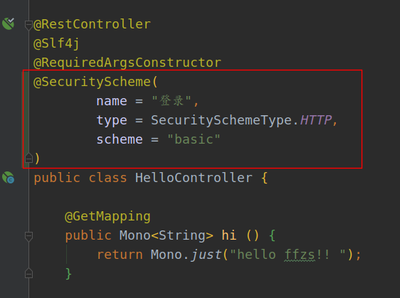
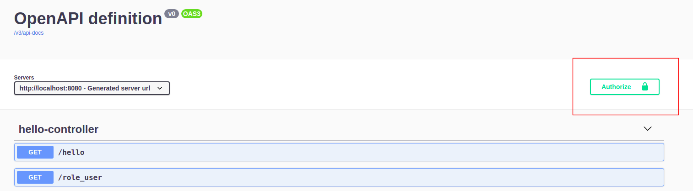
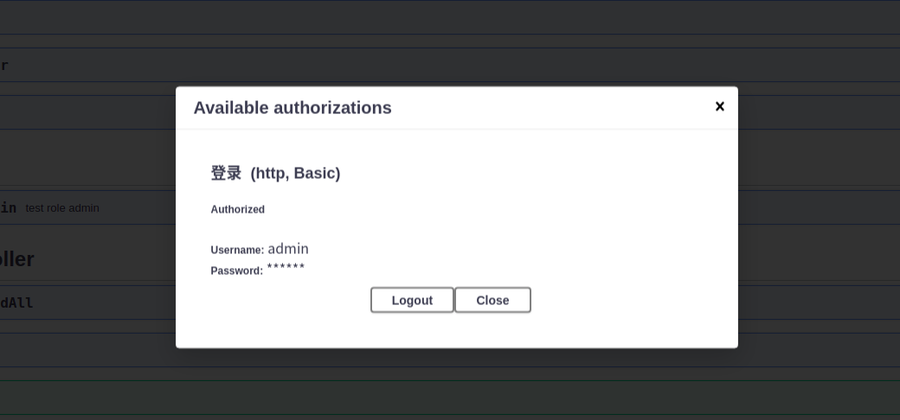
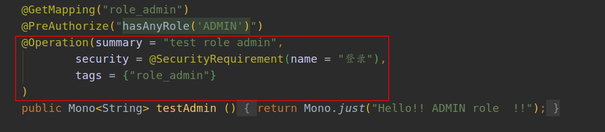
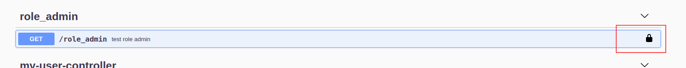

# Spring WebFlux (4): 使用springdoc openapi测试登录security设置

首先设置在设置全局filter时，将swagger相关的网址授权：

登录设置：

### 1. swagger全局登录设置，在controller文件中进行设置：

设置之后可以在标红处进行登录：

登录之后便可测试api：

### 2. 对某个路由进行设置

设置之后，可以在红框处进行登录：

